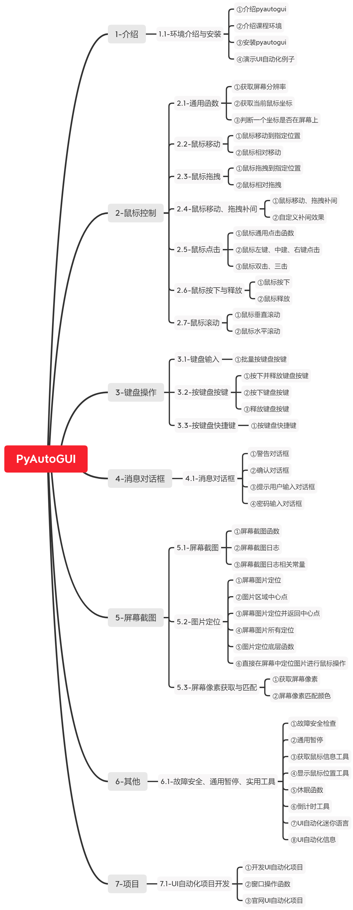

Python PyAutoGUI UI自动化
========================

课程介绍
-------

大家是否每天做着重复、繁琐、低效消耗时的鼠标点击、键盘输入...操作？

为啥不试试PyAutoGUI呢？

PyAutoGUI是Python功能强大的UI自动化库

①有鼠标控制、键盘操作、屏幕截图、图片定位、消息对话框、窗口操作...；  
②有倒计时、鼠标坐标颜色抓取小程序、UI自动化迷你语言...；  
③有故障安全、通用暂停...。

本课程，使用讲解PyAutoGUI源码和官方文档的方式，介绍库里面的功能函数、实用工具、故障安全、通用暂停...，并带大家一起开发一个UI自动化项目。

官方文档
-------

课程内容
-------

备注
----

课程代码等内容，在课程资料里面。
